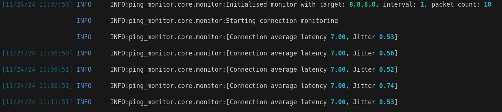

# Ping Monitor

Network quality monitoring with latency, jitter and packet loss tracking.

## Overview
```
[8.8.8.8] Test Result: Average Latency 20.50ms, Jitter 1.20ms (10 results)
[8.8.8.8] Average latency increased by 5.2ms
[8.8.8.8] Test Failed - Connection unavailable
```

## Quick Start
```bash
# Install
git clone <repo> && cd ping-monitor
poetry install

# Setup permissions
sudo setcap cap_net_raw+ep /usr/local/bin/ping_adv
# Alternative
sudo chown root:root /usr/local/bin/ping_adv && sudo chmod u+s /usr/local/bin/ping_adv

# Run
poetry run ping-monitor
poetry run ping-monitor -v  # verbose mode
```

## Configuration
```toml
[monitor]
target = "8.8.8.8"    
packet_count = 10      
interval = 1.0         

[logging]
level = "INFO"         
```

## Development
```bash
poetry shell

pytest               # test
pytest --cov         # coverage
ruff format/check .  # format/lint
```

## Requirements
- Python 3.12+
- Poetry 1.7+


## Tips
```bash
Poetry Installation

curl -sSL https://install.python-poetry.org | python3 -
export PATH="/home/$USER/.local/bin:$PATH"
```

